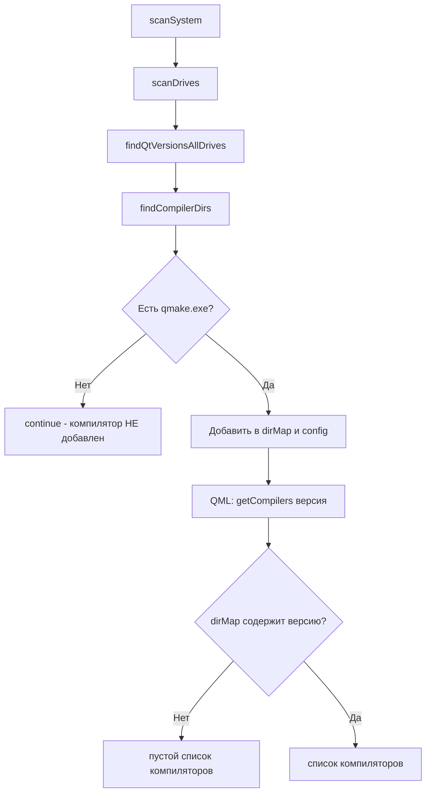
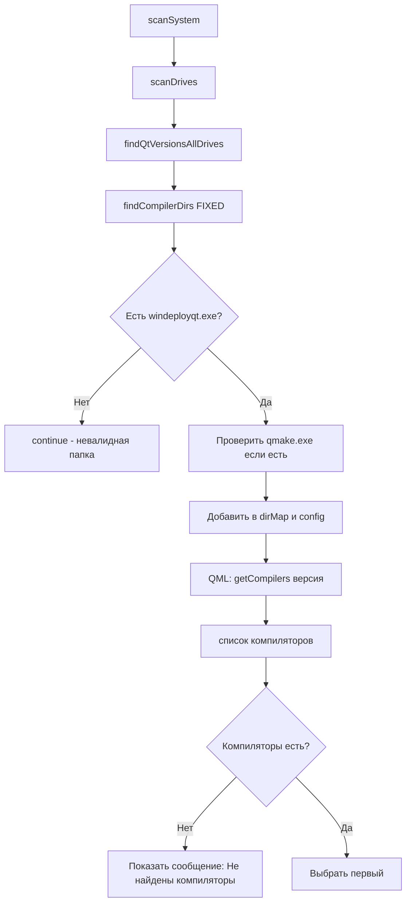

# План: Исправление загрузки компиляторов для выбранной версии Qt

## 1. Анализ проблемы

### 1.1 Корневая причина

В методе [`QtFolderScanner::findCompilerDirs()`](QtFolderScanner.cpp:240) на строке 265:

```cpp
QString qmakePath = folderPath + "/bin/" + Constants::QMAKE_EXE;
if (!QFile::exists(qmakePath)) continue;  // ← если qmake.exe нет — компилятор НЕ добавляется
```

**Проблема:** Начиная с Qt 6, `qmake.exe` стал опциональным. В Qt 6.8+ официальные установки могут не содержать `qmake.exe`, так как Qt перешёл на CMake. Вместо `qmake` для развёртывания используется `windeployqt.exe`, который всегда присутствует в папке `bin/` компилятора.

### 1.2 Вторичные проблемы

1. **Мёртвый код `scanDirectory()` и `isValidQtDirectory()`** — эти методы не используются. `scanDirectory()` пытается искать Qt по структуре папок с версиями, но компиляторы не добавляет. Основной поиск идёт через `findQtVersionsAllDrives()` → `findCompilerDirs()`.
2. **Отсутствие `break` в `getEnvironmentCommands()`** — цикл по `config` продолжается после нахождения нужной конфигурации.
3. **`getQtVersions()` возвращает ключи `dirMap`** — если компиляторы не найдены, то и версии пусты.
4. **В QML нет обработки пустого списка компиляторов** — не отображается сообщение пользователю, что компиляторы не найдены для выбранной версии.

## 2. Диаграмма потока данных (текущее состояние)



## 3. Диаграмма исправленного потока



## 4. Изменения в коде

### 4.1 [`QtFolderScanner.cpp`](QtFolderScanner.cpp) — `findCompilerDirs()`

**Было (строка 265):**
```cpp
QString qmakePath = folderPath + "/bin/" + Constants::QMAKE_EXE;
if (!QFile::exists(qmakePath)) continue;
```

**Стало:**
```cpp
// Проверяем наличие windeployqt.exe — он обязателен для развёртывания
QString deployToolPath = folderPath + "/bin/" + Constants::WINDEPLOYQT_EXE;
if (!QFile::exists(deployToolPath))
{
    qWarning() << "windeployqt.exe не найден в" << folderPath << "пропускаем";
    continue;
}

// qmake.exe опционален, проверяем только для логирования
QString qmakePath = folderPath + "/bin/" + Constants::QMAKE_EXE;
if (!QFile::exists(qmakePath))
{
    qInfo() << "qmake.exe не найден в" << folderPath << "(опционально)";
}
```

### 4.2 [`QtFolderScanner.h`](QtFolderScanner.h) — удаление мёртвого кода

Убрать объявления:
- `void scanDirectory(const QString &path);`
- `bool isValidQtDirectory(const QString &path) const;`

### 4.3 [`QtFolderScanner.cpp`](QtFolderScanner.cpp) — удаление мёртвого кода

Убрать реализации:
- `void QtFolderScanner::scanDirectory(const QString &path)` (строки 76-100)
- `bool QtFolderScanner::isValidQtDirectory(const QString &path) const` (строки 102-113)

### 4.4 [`QtFolderScanner.cpp`](QtFolderScanner.cpp) — `getEnvironmentCommands()`

Добавить `break;` в цикл (строка 215):
```cpp
if (cfg.compilerPath == compilerDir.absolutePath() &&
    cfg.version == version)
{
    out = cfg.environmentCommands;
    break;  // ← добавить
}
```

### 4.5 [`QtFolderScanner.cpp`](QtFolderScanner.cpp) — `getCompilers()`

Метод уже корректный, но добавим `qInfo()` для пустого результата:
```cpp
QStringList QtFolderScanner::getCompilers(const QString &version) const
{
    if (!dirMap.contains(version))
    {
        qInfo() << "Компиляторы не найдены для версии:" << version;
        return {};
    }
    // ... остальное
}
```

### 4.6 [`main.qml`](main.qml) — обработка пустого списка компиляторов

Добавить `enabled` в `compilerCombo`:
```qml
ComboBox {
    id: compilerCombo
    Layout.fillWidth: true
    model: compilerListModel
    textRole: "text"
    enabled: compilerListModel.count > 0  // ← добавить

    // currentText → currentIndex для надёжности
    onCurrentIndexChanged: {
        if (currentIndex < 0 || compilerListModel.count === 0) return
        const compilerPath = compilerListModel.get(currentIndex).text
        // ...
    }
}
```

## 5. Тесты

Обновить тесты в [`tests/tst_QtFolderScanner.cpp`](tests/tst_QtFolderScanner.cpp):
- Удалить `testIsValidQtDirectory()` — удалённый метод
- Заменить проверку с `qmake` на `windeployqt`
- Добавить тест `testFindCompilerDirs_withoutQmake_shouldStillWork()`

## 6. Порядок выполнения

1. **QtFolderScanner.cpp**: `findCompilerDirs()` — замена `qmake.exe` → `windeployqt.exe`
2. **QtFolderScanner.cpp**: удаление мёртвого кода (`scanDirectory`, `isValidQtDirectory`)
3. **QtFolderScanner.h**: удаление объявлений мёртвого кода
4. **QtFolderScanner.cpp**: `getEnvironmentCommands()` — добавить `break`
5. **QtFolderScanner.cpp**: `getCompilers()` — добавить логирование пустого результата
6. **main.qml**: улучшение обработки пустого списка компиляторов
7. **Тесты**: обновление (удаление testIsValidQtDirectory, добавление нового теста)
8. **Сборка и проверка**
